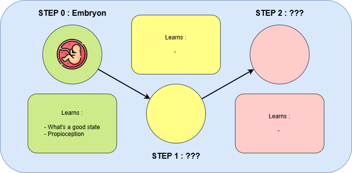

# Entity Simulation

## Goal :

Create physical intelligence througt animal-like brain training.

## Description :

This projects aims to train a animal-like entity to represent the world by evovling in different stage of its life.

------

### Stages :

#### STEP 0 : Embryon :

In this stage, the entity is : 
- in a confined place
- in a sweet liquid ?

Idea : Creation of a need

The idea is that this place is the perfect environment, it allow learning __what the model should aim and how sensors are in those situation__

Learns :

1. ___Suggar's need :___

As the embryon entity is in a perfect spot, after being born, the entity will then search to find the same confort by trying to reach the same situations, so it will be attracted by __sugar__

2. ___Proprioception and touching things :___

Same idea for the contact, as the embryon is in contact with a lot of things, touching things is related for him to a positive thing, so it will try to imitate this, and search for heat and contact.

Those things learned will guide the entity through

#### STEP 1 : new-born :

To be defined
